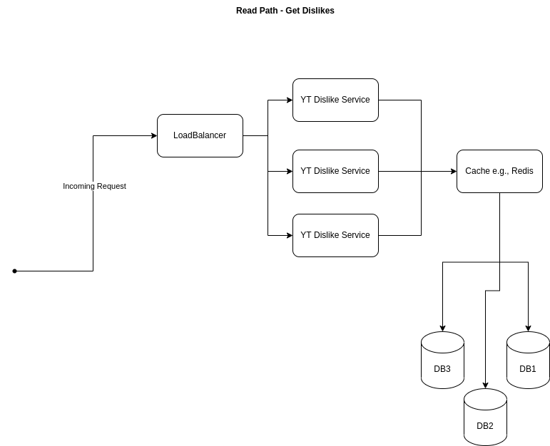

# YouTube Dislike Extension

## Requirements
* Users can dislike videos

## Usage

* 1 billion views / day 
  * half i.e., 500 million dislikes a video daily  
* 200 million videos added monthly

## SLOs

* Stats available as soon as video loads
* Assume YouTube videos load in 100ms

## API
* get_dislikes(video_id)
* add_dislike(video_id,user_id)

## Assumptions

* Browser extensions can extract user identifiers from webpages

## Storage

* I decided to use NoSQL DB to represent the data because we can easily represent the data relation with a table
```
{
  video_id: identifier (string 15bytes)
  total_dislikes: number (64bit int)
  users: {
    user1: 1 
  }
}
```

* YouTube uses a video identifier of 11 bytes. We use 15 bytes to provide wiggle room

* With ~6000 dislikes/second and ~12000 views/second, we have a read-heavy system.
  * NoSQL DB would be perfect and a possible option is MongoDB 
  * Cost of using MongoDB
    * Dedicated Infra
  ```
    $10.99/hr for a 1TB storage, 192GB RAM server = $96,008.64/year
  ```
    * Serverless 
  ```
    Storage: $0.25/GB per month = $250 (for 1TB storage) 
    Data transfer: $0.10/GB  =  ~$200M (for 714kb/s)
    Write processing: $1.24/million = unnecessary
    Read processing: $0.30/GB = unnecessary
  ```
  * From calculations, managed NoSQL db is too expensive.
  * Therefore, we will host an open-source NoSQL DB (e.g. Cassandra) on a managed cluster
    * Storage requirements = 3TB/year
      * We can add more disks over time but 5TB will be a good start
    * If we run a GKE cluster of 3 nodes with each node disk size of 1TB, this costs $575.53/month (approx. $6906.36).

## Calculations

* Views
```
  1 x 10^9 / 86400 = ~12000 views/second
```

* Videos added
```
  2 x 10^8 / 2.6 x 10^6 = ~80 videos added/second
```

* Daily dislikes
```
 5 x 10^8 / 86400 = ~6000 dislikes / second
```

* Data transferred for read DB request
```
  8 bytes (total_dislikes) + 15 bytes (video_id) = 23 bytes / request
```

* Data transferred for write DB request - assume user id is 50bytes max
```
  8 bytes (total_dislikes) + 15 bytes (video_id) + 50 (user_id) = 73 bytes / request
```

* Total Data to be stored for 200M videos. Assume each video can be represented with 3kb on average in the db. Note that the user dictionary means we can't know exactly.  
```
  2 x 10^8 x 3 x 10^3 = 6 x 10^11bytes = 600GB
  Let's assume 1TB
```

* Bandwidth needed
```
  (12000 views (read req) * 23bytes) + (6000 dislike (write req) * 73 bytes) = 276000 bytes/s + 438000bytes/s = 714kb/s

  Bandwidth needed = 714kb x 8 =  ~6mbps
```

## Architecture




## Privacy Considerations

* To get a closer estimation about the amount of dislikes, we store user ID. 
* Users can also remove dislikes after the current session is ended because we have a record of the users that have disliked the video
* However, storing user IDs opens up the user to tracking.
* In the context of ShadyCorp, that's perfect but for the users, it is not good at all.
* To prevent tracking, we could remove the addition of user IDs. 
* However, we lose the possibility to remove dislikes outside of the current session.
* We could also ship some sophisticated crypto private information retrieval but then, less is more.

