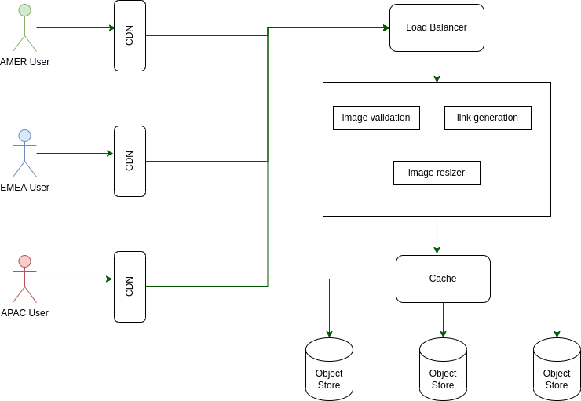

# Design of an Image Hosting Service

Design an image hosting service with shareable urls

## Functional Requirement
* User can upload images and reference it using a url
* Process images to some size without losing quality
* Images do not change after upload and can not expire

## SLOs
* 300ms latency 
* 99% available for writes and 99.9% availability for reads
* 10s latency before a new image is shareable

## Image Requirements
* Default resolution is based on the user device.
* We provide 4 standard image resolutions[1].
  ```
  If we assume 2KB of metadata, the pictures will have the following sizes below:
    * 1920 x 1080 -> from 6MB
    * 1280 x 720 -> from 2MB
    * 1080 x 1080 -> from 3.5MB
    * 800 x 600 -> from 2MB
    * 160 x 160 -> from 500KB
  ```
  The size estimates were calculated using the omni calculator [2]

## Load calculations
*Note, we assume that the average image is 7MB*

* Image uploads 
```
  5x10^6 / 86400 = ~6 images/s
  Request size = 6 x 7MB = ~50MB/s
```

* Image views
```
  5x10^6 / 86400 = ~60 image views/second
  Request size = 60 x 7MB = ~500MB/s
```
* Total Request Size: 550MB/s

* After a year, the views and the upload increase by an average of 40%
```
  - uploads becomes = ~9 images/s
  - views becomes = ~90 images/s
  - request becomes = ~800MB/s
```

## Storage

* We store about 20MB of images for each upload.
  ```
  Daily storage needed = 20MB x 5 x 10^6 = 1 x 10^13 = 10TB/day
  Yearly storage needed = 10TB x 365 = 3.65PB
  ```
* We can't store 3.65PB on a single machine.
  * We need a distributed form of storage

* DB store vs File system store vs Object storage?
  * We can store the BLOBs in DBs but do we need the extra power?
  * If we use filesystems, can we ensure the files are flushed to disk?

* Pros and cons of s3 object storage 
  * No need to design a distributed file system
  * No need to worry about data loss. We can easily backup on s3
  * Increasing yearly costs! But it is possible to move old data into infrequent access archive (thereby reducing year on year costs)

* AWS S3 object storage costs $0.021/GB [3] for frequent access
  ```
  3.65PB = $0.021 x 3 x 10^6 = $63000/year
  ```

## System Services

* upload_service(image): within each service, we have the following
  * image_validation
  * link_generation (async)
  * image_resizer (async)

## System Design



## NOTES
### Other Requirements
* Basic tracking
* Users might have to wait before sharing
* Ads might be added. Images might be shown on webpage
* Images should not be discoverable
* Offer standard resolutions and convert on the fly

### Think about
* Input validation
* Offline processing
* Larger datasets
* Images and only gifs
* permissivve image formats

## References

1. https://www.shutterstock.com/blog/common-aspect-ratios-photo-image-sizes
2. https://www.omnicalculator.com/other/image-file-size
3. https://aws.amazon.com/s3/pricing/
