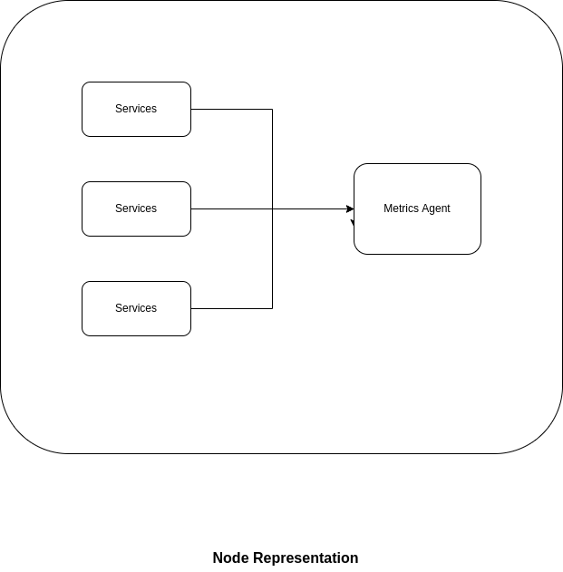
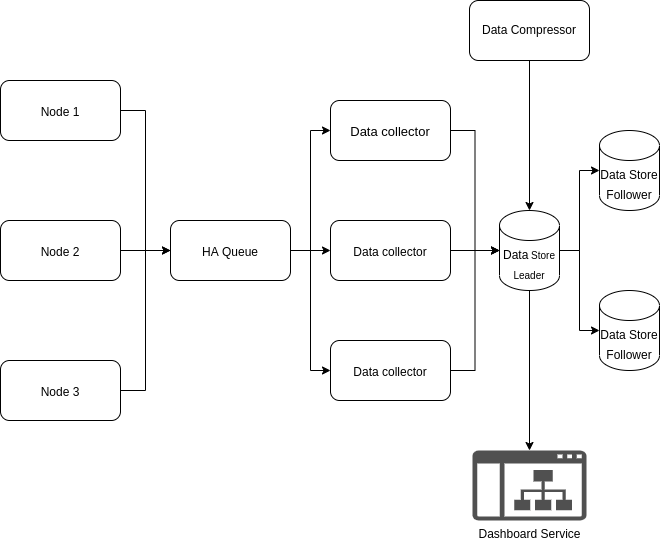

# Metrics Aggregation Service

Design of a global service that aggregates metrics from all other services in the larger system

## Requirements
* Gather performance data from all services
  * Ideally in a manner that aids pattern detection
* Metrics are collected every minute (or less)
* Basic metrics are automatically collected
  * But devs set up other metrics too
* Metrics are presented on a dashboard
  * Must be possible to search, filter and tag

### Larger System Description
* Image hosting service
* URL Shortening Service
* Question & Answer Service
* Metrics Service

### Data Retention
* Recent data are more important than historical data
  * Meaning we could compress historical data

### Growth Projections
* Amount of metrics will double yearly

### Usage Requirements
* Most of the engineers will interact constantly with this service
  * Approx 100 engineers

### Budget
* High priority project for the company
  * If you can justify the cost, it will be approved
  * Small team of engineers for 1 year

## Error Budget 
* Some errors are allowed but not specified

## SLOs
* Most recent metrics must be viewable after 1m

## General Thoughts
* A metrics collection service must be reliable and available most of the time. 
  * Why? Because if the larger system goes down, the metrics service is needed to understand the cause of failure
  * I would suggest an availability of 99.99% of the time

* No data should be lost except the data that we discard
  * We convert fine-grained data to coarse-grained data for historical data
  * More recent data are as fine-grained as possible
  * Data is sent in batches every minute

## Service Components

* Node agent
  * Collects data from the services on a node
  * Forwards the data to the message queue
* Message queue
  * Receives the metrics data and keeps it on a queue
* Data collector
  * Subscribes to the message queue
  * Receives metrics data from the queue and pushes the data to storage 
* Data store
  * Location where the data is stored
* Data Compressor
  * Aggregates historical data 
  * Scans the database every day and compress data older than 14 days
* Dashboard Service
  * Service to display the data in an easily consumable form
* Instrumentation API
  * API to facilitate instrumentation of individual services

## Metric Types
* App-specific Metrics
  * Could be general metrics on requests or could be specific to a service
* Environment Metrics
  * Metrics about the node e.g., CPU, Memory, IO e.t.c

## Scattered thoughts

* instrumentation api
* Question, how do we monitor the metrics service itself?
* batching data collection
* maybe use a resilient queue? Maybe rabbitMQ in its HA form?
* data collector
* data aggregator
* dashboard service
* time series data?
* replicate & partition data
* How do we know the amount of tracing data each service generates?
  * Do we even need to know the amount of data? Or can we just have large stores?
* Types of metrics to collect
  * Events 
  * traces
  * Metrics
* Data processor can give a mode to define new metrics
* How do we represent metrics? Prometheus uses metrics name, labels, Timestamp, value


## Calculations

* Lets assume the following:
  * The large system has 4 main subsystems - [see here](#Larger System Description)
  * Each subsystem has at 6 services that need monitoring
  * A node can contain any mix of at most 5 services
  * On average we have about 6 nodes 

* A node agent collects 1 minute worth of metrics from 5 services.
  * Assume 1 minute worth of metrics is about 1kb (I have no way to back this assumption or reason through its)
  ```
  6 nodes x 1kb = 6kb / minute
  6kb x 525600 = 3153600000 bytes/ year = ~4GB / year
  ```

* The message queue has to handle 6kb per minute

* Our data store needs to only store around 4GB raw data (uncompressed) per year.

## Data Storage

* We will use a data storage optimized for time series data
  * InfluxDB 

* We will use semi-synchronous data replication with InfluxDB

## Architecture



## Questions

* What are the possible pros and cons of pushing vs pulling metrics?


## References
