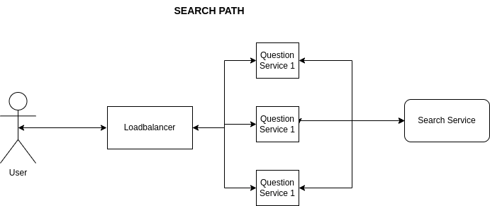

# System Description

A website for people to post questions and answers.

## High-level Requirements
* Users can vote i.e., upvote and downvote
* Users should have access to 2 views i.e., recent questions and popular questions
  * Views should be a page's worth 
* The system should support the following: 
  * 10 million users 
  * 5 million questions / year
  * 20 million answers
  * ~~500 million viewers / year~~
  * ~~200 million queries / month~~
  * 500 - 1000 search queries / second at peak
* Questions should have a reasonable length
* Users are restricted to one geographic location i.e., EU version or American version.
* Assume that all users see the same set of question on the views.
* Users can edit questions and delete questions. (ok, if they can't too)
* Questions have a title and a body.
* Users can search questions and answers
* Search requests should return top 100 results.
  * The results can be ordered by votes, relevance and views.  


## SLOs
* 99.9% Uptime
* Answers should appear with 5 seconds of creation
* 95% of updates are searcheable after 10s
* 100% of updates are searchable after 1 day
* 99% of search request receives a response within 1s.

## Single Machine 

* Questions are stored in a question DB with the following structure:
  ```
  * q_id: question ID -> bigint (8 bytes) 
  * question_title: question title -> varchar(100) 
  * question_body: question body -> text // unlimited char storage
  * time: time created -> timestamp (8 bytes)
  * user_id: ID of user that created it -> bigint (8 bytes)
  * votes: number of votes -> bigint (8 bytes)
  ```

* Answers are stored in an answer DB table with the following structure:
  ```
  * a_id: answer ID -> bigint (8 bytes)
  * q_id: question ID -> bigint (8 bytes)
  * user_id: ID of user that created it -> bigint (8 bytes)
  * time: time created -> timestamp (8 bytes)
  * answer: answer -> text // unlimited char storage 
  ```

* Users are stored in a user DB table with the following structure:
  ```
  * user_id: user ID -> bigint (8 bytes)
  * first_name: first name -> varchar(50)
  * last_name: last_name -> varchar(50)
  * time: time account was created -> timestamp (8 bytes)
  * password: user's password -> varchar(1000) // is this too small?
  * pass_salt: random salt added to user password -> varchar(50)
  ```

* From the structure above, a relational DB e.g., MySQL or Postgres is suggested.
  * Maybe a NoSQL DB might work too but that needs further examination
  * q_id, a_id and votes are indexed in the relational DB

### Calculations

* The system should support the following assuming we have 3.2 x 10^7s  in a year:
  * 10 million users / year 
    * 1 x 10^7 / 3.2 x 10^7 = 0.31 user/second creates an account
  * 5 million questions / year
    * 5 x 10^6 / 3.2 x 10^7 = 0.16 questions are created per second 
  * 20 million answers
    * 2 x 10^7 / 3.2 x 10^7 = 0.63 answers / second
  * ~~500 million viewers / year~~
    * ~~5 x 10^8 / 3.2 x 10^7 = ~ 16 views / second~~
    * 500 - 1000 queries / second

* we assume that the average unlimited text is about 2000 characters i.e., 2000 bytes

* For data storage

  * For every question insertion, 132 bytes + unlimited amount of text is sent.
    * So, about 2.3kb is sent on each insert
    * over a year:
      * 2.3 x 10^3 x 10^7 = 23GB

  * For each answer insertion, 32 bytes + unlimited amount of text is sent.
    * So, about 2.1kb is sent on each insert
    * over a year:
      * 2.1 x 10^3 x 2 x 10^7 = 42GB

  * A total of ~100GB/year is needed. 
    * Total queries / second for DB -> 16 + 0.63 + 0.16 + 0.31 = ~18. Let's use 20 db queries / second
    * A 4TB HDD can handle 200 IOPS. 
      * Assuming 1 query can be handles in one disk write:
        * 20 / 200 = 0.1 disk is needed per second

* A single machine can work fine with regards to storage and a 4TB disk will only fill up after 40 years.
  * What if we want to keep all the data in RAM? 

* For reliability and availability, a database resident on a single machine will fail our SLO requirements

* We will skip user creation and management for now

## Distributed System

* Based on the requirements described above,
  * The website has less than 1 write per second and about 16 reads per second.

* We need to replicate the database to multiple locations. 
  * A minimum of 3 replicas would be sufficient.
  * Semi-synchronous replication will be used.


## Retrieving Views

* Recent Questions View
  * This view is created with a "select" and "group by time created" SQL statement
  * The questions are displayed in that order with 25 questions / page

* Popular Questions View
  * This view is created with a "select" and "group by votes" SQL statement
  * The questions are displayed in that order with 25 questions / page

* Since we have less than 1 write per second, we can cache the views. 

## Search Service

| Name      | Unit Cost | Our Cost|
| ----------- | ----------- | ----------- |
| Algolia      |$1.00/1k requests/mo | approx. $30/month  |
| Meilisearch   |opensource   | infra & maintenance cost|
| Typesense   |opensource & hosted     | infra & maintenance cost |
| Lucene/solr   | opensource        | infra & maintenance cost|
| Elastic Search   | opensource & hosted| infra & maintenance cost|

* All the options above provide the basic requirements for search.
  * Algolia search queries take between 1 - 20ms.
  * Meilisearch search queries take between 40 - 100ms.
  
* However, do we want a paid version or open source version?
  * An open-source version incurs maintenance cost which is higher than $30/month
  * The costs of a paid version would probably keep increasing

* If the website is monetized, a paid search service such as Algolia would suffice
  * Else, we will use an open source version such as Meilisearch.

## Data Conversion
* Regardless of which search service we choose, we need the data in JSON.
  * Extract from database
    * Running background process to extract db rows, convert them to JSON
  * Format and structure of the JSON record
    ```
    [
      {
        "title": "question_title",
        "body": "question_body",
        "votes": number of votes,
        "permalink": link,
      },
      {
        "title": "question_title",
        "answer": answers,
        "permalink": link,
      },
    ]
    ```

## Architecture Diagram





## Refs

* https://blog.codinghorror.com/youre-probably-storing-passwords-incorrectly/
* https://www.postgresql.org/docs/9.6/datatype.html
